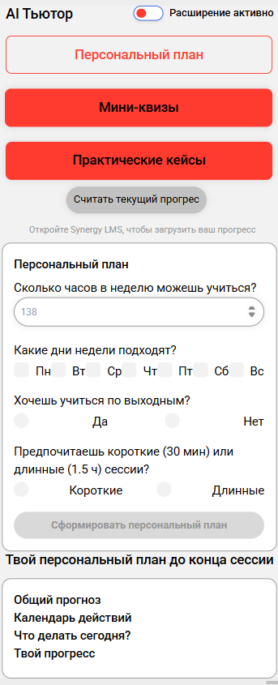
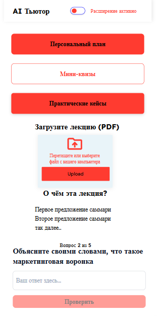
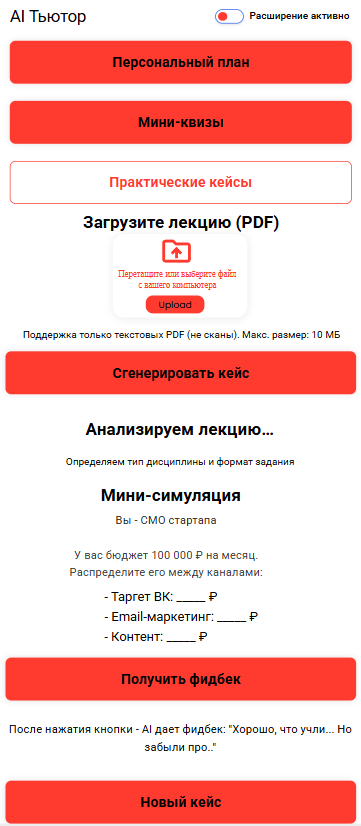

# 🧩 Основные функции, путь пользователя , UI/UX расширения

## 🔹 1. Персональный план обучения  
**Поток пользователя:**  
1. Студент заходит в LMS.  
2. Открывает расширение → нажимает **`Персональный план`**.  
3. Видит:  
    * кнопку **`Считать текущий прогресс`** → расширение парсит DOM: какие дисциплины и темы пройдены, текущий календарный график,
    * форму с обезличенными вопросами:
      * `сколько часов в неделю можешь учиться?` *(число)*
      * `какие дни недели подходят?` *(чекбоксы: Пн–Вс)*
      * `проходишь дисциплины последовательно или хаотично?`(текст)
      * `предпочитаешь короткие (30 мин) или длинные (1.5 ч) сессии?`(текст)

4. После заполнения → появляется кнопка **`Сформировать персональный план`**.  
5. При нажатии → данные отправляются на backend.  
6. Backend:  
    * формирует промт :
```markdown
Ты — персональный тьютор университета с 10-летним опытом в планировании обучения.   
На входе у тебя:
• учебный план студента (список дисциплин, тем внутри них, дедлайны),
• текущий прогресс (какие темы уже пройдены),
• ответы студента на вопросы:
  • сколько часов в неделю может уделять,
  • какие дни доступны,
  • длительность сессии (30 мин / 1.5 ч),
  • стратегия прохождения (последовательно / хаотично).
Сформируй персональный план в формате Markdown, строго по следующей структуре:
   1. Общий прогноз
Если студент успевает закрыть все дисциплины до конца сессии → напиши:
✅ Ты успеваешь закрыть всё до [дата окончания сессии].
Если не успевает → рассчитай, на сколько нужно увеличить время или добавить дней, чтобы успеть, и напиши:
⚠️ Чтобы успеть до [дата], тебе нужно: – либо добавить [X] часов в неделю, – либо заниматься ещё в [дни, например: Пн, Ср].

   2. Календарь действий
• Создай таблицу с колонками: Дата, Что делать?, Время.
• Не используй колонку “Статус” — она не нужна.
Если студент успевает:
• Распредели время неравномерно: больше времени там, где больше тем; меньше — где легче.
• Учитывай реальную сложность (например, “Финансы” → 1.5 ч, “История” → 30 мин).
Если не успевает:
• Добавь дополнительные дни в календарь (даже если студент их не указывал),
• Увеличь время в сессии до необходимого (например, 2 часа вместо 1.5).
В колонке “Что делать?” пиши только:
• Зайти в LMS, пройти материал
или
• Зайти в LMS, пройти материал + сдать итоговый тест (если близко к дедлайну).
Не упоминай названия дисциплин или тем — это есть в LMS.
>💡 Нужно предусмотреть возможность сохранения этого календаря: как локальный файл (PDF/Markdown) через кнопку «Скачать план»,

   3. Что делать сегодня?
• Если успевает:
Укажи:
Сегодня, [дата] ([день недели])
– Зайти в LMS
– Пройти материал по [название дисциплины]
– Потратить [X] часов
• Если не успевает:
Дай конкретную рекомендацию на основе прогноза:
Сегодня критически важно наверстать отставание. – Зайти в LMS – Пройти [N] тем по [дисциплине] – Потратить [X] часов (это поможет вернуться в график)

   4. Твой прогресс
Укажи:
• До конца сессии: [X] дней
• Пройдено тем: [Y] из [Z]
• Прогноз: ✅ Успеваешь или ⚠️ Не успеваешь

📌 Общие правила
• Используй только текст, списки, таблицы, эмодзи.
• Не используй изображения, диаграммы, Mermaid, HTML.
• Тон — спокойный, поддерживающий, без давления.
• Всё должно быть понятно с первого взгляда, без пояснений.
```
  * возвращает результат
7. Расширение отображает:
    * персональный план до конца семестра,
    * блок `Общий прогноз`
    * блок `Календарь действий`
    * блок `Что делать сегодня`.
> ⚠️ Важно: если прогресс не считан (например, студент не в LMS) → кнопка **`Сформировать план`** неактивна.

## UI :  



## 🔹 2. Генерация мини-квизов
**Поток пользователя**:  
1. Студент проходит тему в LMS.  
2. Нажимает **`Скачать лекцию`** → получает `PDF`.  
3. Открывает расширение → нажимает **`МИНИ КВИЗЫ`**.  
4. Загружает PDF-файл (через `<input type="file">`).  
5. Расширение отправляет файл на backend.
6. Параллельно парсится DOM: специальность студента, текущий курс  
7. Backend:
   * извлекает текст из загруженного PDF,
   * формирует промпт для LLM:
```markdown
Ты — опытный преподаватель и методист в области высшего образования.
Твоя задача — помочь студенту глубже понять материал лекции, а не просто «пройти тест».
Исходные данные:
Текст лекции (извлечён из PDF)
Специальность студента: [специальность] (например, «UI/UX дизайнер»)
Уровень обучения: бакалавриат, 3 курс
Контекст: студент учится дистанционно, совмещает с работой, часто испытывает когнитивную перегрузку

Выполни следующие шаги строго по порядку:
1.Сделай краткое саммари (3–5 предложений)
— Обобщи суть лекции простым, понятным языком
— Не используй термины без пояснения
— Сфокусируйся на главной идее, а не на деталях
2.Объясни ключевые концепции
— Выдели 2–4 центральные идеи или термина из лекции
— Объясни каждую простыми словами, как будто студент видит её впервые
— Приведи один короткий пример из реальной жизни или бизнеса, связанный со специальностью студента
3.Сгенерируй 5 вопросов в формате открытого ответа

Требования к вопросам:
❌ НЕ повторяй вопросы из официальных тестов LMS (никаких «выберите верное утверждение»)
✅ Формулируй только открытые вопросы, требующие размышления:
• «Как бы вы объяснили это коллеге?»
• «Почему это важно для стартапа?»
• «Приведите пример из вашей практики»
✅ Вопросы должны проверять понимание, а не память
✅ Один вопрос должен быть практико-ориентированным («Как бы вы применили это в проекте?»)
✅ Один вопрос — рефлексивным («Что вас удивило / вызвало сомнение?»)
4.После каждого вопроса подготовь краткий разбор
— Не давай «правильный ответ», а предложи ключевые критерии хорошего ответа:
• «Хороший ответ должен включать: X, Y, Z»
• «Обратите внимание на различие между A и B»
— Это поможет студенту самостоятельно оценить своё понимание

Запрещено:
Генерировать вопросы в формате теста (A/B/C/D)
Подсказывать конкретные формулировки для сдачи
Использовать сложную терминологию без пояснения
Делать выводы за студента
Тон:
— Спокойный, поддерживающий, как наставник
— Без давления, без «ты должен»
— Акцент на мышлении, а не на «правильности»
```
   * возвращает результат.  
8. Расширение показывает:
   * саммари с основными концепциями 
   * мини-квиз в формате `*step-to-step*`
   * кнопку **`Проверить`** (если задание закрытое).  

**Технические ограничения**:
   * Макс. размер PDF: 10 МБ
   * Поддержка только текстовых PDF (не сканы)
   * Если PDF не содержит текста → ошибка: `Файл не поддерживается. Загрузите текстовую лекцию`

## UI :  



## 🔹 3. Генерация практических заданий
**Поток пользователя**:  
1. Студент проходит тему в LMS.  
2. Нажимает **`Скачать лекцию`** → получает `PDF`.  
3. Открывает расширение → нажимает **`ПРАКТИЧЕСКИЕ КЕЙСЫ`**.  
4. Загружает PDF-файл (через `<input type="file">`).
5. Нажимает кнопку **`Сгенерировать кейс`**
6. Расширение отправляет файл на backend.
7. Параллельно парсится DOM: специальность студента, текущий курс, прогресс
8. Backend:
   * извлекает текст из загруженного PDF,
   * формирует промпт для LLM:
```markdown
Ты — опытный методист и преподаватель высшей школы.
Твоя задача — сгенерировать один практический кейс, который поможет студенту глубже понять материал лекции и применить его в реальной жизни или учебной практике.
Исходные данные:
— Текст лекции (извлечён из PDF)
— Специальность студента: [специальность]
— Уровень обучения: [курс] курс, бакалавриат
— Контекст: студент учится дистанционно, часто совмещает с работой, испытывает когнитивную перегрузку

Выполни следующие шаги строго по порядку:
1. Проанализируй лекцию и определи тип дисциплины
На основе содержания определи, к какому типу относится дисциплина:
— Гуманитарная (история, социология, право, психология и т.д. и т.п.)
— Техническая (программирование, математика, ИИ, финансы и т.д. и т.п.)
— Управленческая (маркетинг, управление проектами, предпринимательство и т.д. и т.п.)
2. Выбери формат кейса, исходя из специальности, курса и типа дисциплины
Используй только один из следующих форматов — тот, что максимально соответствует контексту:
Если студент учится на технической специальности (3+ курс) →
Формат: «Чек-лист с пропусками»
— Задание должно требовать расчётов, логики, точных ответов
— Пример: «Рассчитайте CAC, если бюджет = X, а лидов = Y»
Если студент учится на управленческой специальности (любой курс) →
Формат: «Мини-симуляция»
— Дай роль (которая подходит лекционному материалу)
— Предложи принять решение в условиях ограниченных ресурсов
— Пример: «Распределите бюджет между каналами»
Если студент учится на гуманитарной специальности или 1–2 курс →
Формат: «Рефлексия по опыту»
— Попроси связать теорию с личным/профессиональным опытом
— Пример: «Опишите ситуацию, где вы сталкивались с этим явлением»
3. Сформулируй кейс по выбранному формату
Требования:
❌ НЕ повторяй задания из официальных тестов LMS
✅ Делай задание открытым — без единого правильного ответа
✅ Связывай с реальной практикой специальности студента
✅ Используй простой язык, без жаргона
4. Подготовь краткий фидбек для студента
После выполнения кейса студент получит разбор:
Не давай «правильный ответ»
Вместо этого опиши ключевые критерии хорошего ответа:
• «Хороший ответ должен включать: X, Y, Z»
• «Обратите внимание на различие между A и B»

Запрещено:
— Генерировать вопросы в формате теста (A/B/C/D)
— Подсказывать готовые формулировки для сдачи
— Использовать сложную терминологию без пояснения
— Делать выводы за студента

Тон:
— Спокойный, поддерживающий, как наставник
— Без давления, без «ты должен»
— Акцент на мышлении, а не на «правильности»
```
   * возвращает результат.  
8. Расширение показывает:
   * описание кейса
   * интерактивные поля
   * кнопку "Получить фидбек"

**Технические ограничения**:
   * Макс. размер PDF: 10 МБ
   * Поддержка только текстовых PDF (не сканы)
   * Если PDF не содержит текста → ошибка: `Файл не поддерживается. Загрузите текстовую лекцию`

## UI :  

   

>⚠️ Внутри каждого раздела и подраздела расширения обязательно должно быть указано :***`Вы используете AI-тьютор добровольно. Ответственность за сдачу дисциплин — ваш`***
