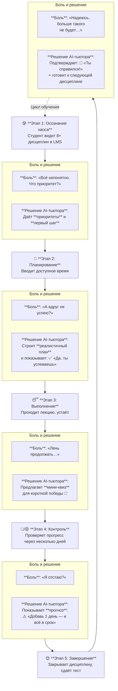

# Customer Journey Map (CJM): AI-тьютор для Synergy LMS

Эта карта описывает путь студента по взаимодействию с AI-тьютором на этапе MVP. Учитывает эмоции, боли и то, как продукт помогает на каждом этапе. Используется для проектирования UX и приоритизации фич.

## 🗺️ CJM: Путь студента от хаоса к уверенности

## 🔑 Ключевые принципы поддержки

- **Не давить** — напоминания поддерживают, не обвиняют.
- **Быть конкретным** — вместо «учись» → «сделай тему 3 в дисциплине Маркетинг до пятницы».
- **Давать ощущение движения** — даже маленький прогресс = визуальный фидбек.
- **Уважать контекст** — студент устал, занят, отвлечён → интерфейс должен работать за 10–30 секунд.

## 📊 Что измеряем на каждом этапе

| Этап | Метрика успеха |
|------|----------------|
| Осознание хаоса | % студентов, которые сразу поняли «что делать сегодня» |
| Планирование | % студентов, подтвердивших реалистичность плана |
| Выполнение | Частота возвратов в течение недели |
| Контроль | Изменение поведения после прогноза (добавили часы?) |
| Завершение | NPS: «Насколько тебе помог AI-тьютор?» |

> 💡 **Для разработчиков**: CJM — основа для UX-решений. Любая новая фича должна улучшать один из этих этапов.
