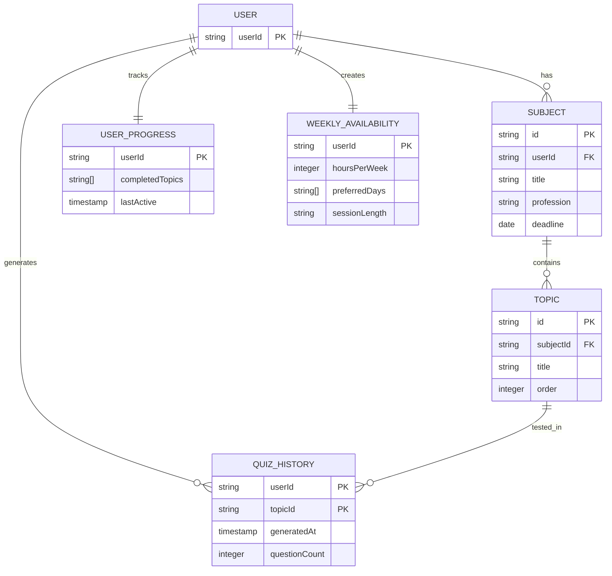

# Data Schema: AI-тьютор для Synergy LMS (MVP)

Все данные хранятся без привязки к личности. Идентификатор пользователя (`userId`) — UUID v4, генерируется расширением.

---

## Сущности

### 1. User
| Поле | Тип | Описание |
|------|-----|----------|
| `userId` | string (PK) | Уникальный ID, генерируется в браузере |
| `createdAt` | timestamp | Дата первого запуска |

> ❗ Нет email, ФИО, группы, курса.

---

### 2. Subject
| Поле | Тип | Описание |
|------|-----|----------|
| `id` | string (PK) | `subj_...` — берётся из DOM LMS |
| `userId` | string (FK → User) | Принадлежность пользователю |
| `title` | string | Название дисциплины |
| `profession` | string | Название специальности |
| `deadline` | date | Дедлайн закрытия|

---

### 3. Topic
| Поле | Тип | Описание |
|------|-----|----------|
| `id` | string (PK) | `top_...` — берётся из DOM |
| `subjectId` | string (FK → Subject) | |
| `title` | string | Название темы |
| `order` | integer | Порядок в дисциплине |

---

### 4. UserProgress
| Поле | Тип | Описание |
|------|-----|----------|
| `userId` | string (PK, FK → User) | |
| `completedTopics` | string[] | Массив `topicId`, отмеченных как пройденные |
| `lastActive` | timestamp | Последняя активность |

---

### 5. QuizHistory 
| Поле | Тип | Описание |
|------|-----|----------|
| `userId` | string | |
| `topicId` | string | |
| `generatedAt` | timestamp | |
| `questionCount` | integer | Сколько вопросов сгенерировано |

> ❗ **Никаких ответов студента не сохраняется.**

---

### 6. WeeklyAvailability
| Поле | Тип | Описание |
|------|-----|----------|
| `userId` | string (PK, FK → User) | |
| `hoursPerWeek` | integer | Часов в неделю |
| `preferredDays` | string[] | ["mon", "tue", ...] |
| `sessionLength` | string | "short" / "long" |

> ⚠️ Эти данные — **обезличенные предпочтения**, не ПДн.

---
## Диаграмма связей

> 💡 Принцип: минимальное хранение, максимальная полезность. Никаких ПДн.
