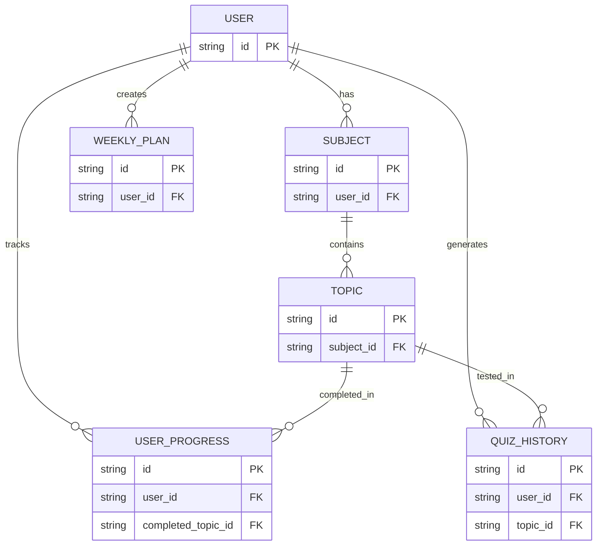

# Data Schema: AI-тьютор для Synergy LMS (MVP)

Все данные хранятся без привязки к личности. Идентификатор пользователя (`userId`) — UUID v4, генерируется расширением.

---

## Сущности

### 1. User
| Поле | Тип | Описание |
|------|-----|----------|
| `userId` | string (PK) | Уникальный ID, генерируется в браузере |
| `createdAt` | timestamp | Дата первого запуска |

> ❗ Нет email, ФИО, группы, курса.

---

### 2. Subject
| Поле | Тип | Описание |
|------|-----|----------|
| `id` | string (PK) | `subj_...` — берётся из DOM LMS |
| `userId` | string (FK → User) | Принадлежность пользователю |
| `title` | string | Название дисциплины |
| `deadline` | date | Дедлайн закрытия (парсится из LMS) |

---

### 3. Topic
| Поле | Тип | Описание |
|------|-----|----------|
| `id` | string (PK) | `top_...` — берётся из DOM |
| `subjectId` | string (FK → Subject) | |
| `title` | string | Название темы |
| `order` | integer | Порядок в дисциплине |

---

### 4. UserProgress
| Поле | Тип | Описание |
|------|-----|----------|
| `userId` | string (PK, FK → User) | |
| `completedTopics` | string[] | Массив `topicId`, отмеченных как пройденные |
| `lastActive` | timestamp | Последняя активность |

---

### 5. WeeklyPlan
| Поле | Тип | Описание |
|------|-----|----------|
| `userId` | string (PK, FK → User) | |
| `plan` | JSON | `{ "2026-02-03": ["top_002", ...] }` |
| `hoursPerWeek` | integer | Введено студентом |
| `excludeDays` | string[] | Например: `["saturday", "sunday"]` |

---

### 6. QuizHistory (опционально, для аналитики)
| Поле | Тип | Описание |
|------|-----|----------|
| `userId` | string | |
| `topicId` | string | |
| `questionIds` | string[] | Какие вопросы были заданы |
| `timestamp` | timestamp | |

> ⚠️ Никаких ответов студента не сохраняется — только факт генерации.

---

## Диаграмма связей

> 💡 **Принцип**: минимальное хранение, максимальная полезность. Никаких ПДн.
