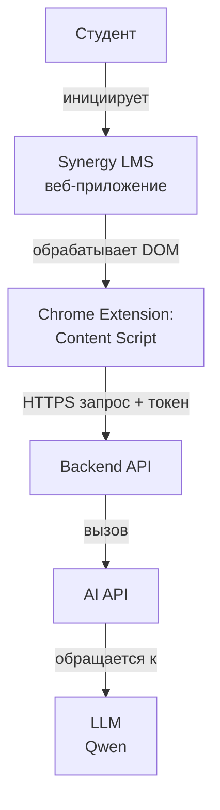

# Сценарии интеграции: AI-тьютор для Synergy LMS

Этот документ описывает типовые пользовательские сценарии с точки зрения технической интеграции.  
Фокус — на том, **как данные движутся**, **где принимаются решения** и **какие компоненты участвуют**.  
Используется как справочник для frontend/backend-разработчиков и для согласования архитектуры.

> 💡 **Контекст**:  
> - Интеграция реализована через **браузерное расширение (Manifest V3)**.  
> - Доступ к данным — **только read-only**, через DOM-парсинг страниц LMS.  
> - Нет доступа к API Synergy LMS на этапе MVP.  
> - Все действия студента — добровольные.

---

## 🧩 Общая архитектура



---

## 📌 Сценарий 1: Инициализация профиля студента

### Условия
- Студент впервые открывает расширение в LMS.

### Шаги
1. **Extension** обнаруживает активную сессию в `lms.synergy.ru`.
2. **Content script** парсит:
   - список дисциплин,
   - для каждой — темы и их статусы (`пройдено`/`не пройдено`, если видны).
3. Формирует структуру:
   ```json
   {
     "subjects": [
       { "id": "subj_123", "title": "Маркетинг", "topics": [...] }
     ]
   }
   ```
4. Отправляет `/user/init` (POST)  
5. Backend:
   * генерирует `userId`(UUID v4),
   * сохраняет структуру обучения,
   * возвращает `userId` и подтверждение.
6. **Extension** сохраняет `userId` локально (chrome.storage).
   
### Ошибки и fallback  
* Если DOM не содержит данных → показать экран: «Не удалось считать программу. Попробуйте обновить страницу».
* Если студент не авторизован в LMS → кнопка расширения неактивна.

---

## 📌 Сценарий 2: Генерация персонального плана обучения  

### Условия  
- Студент нажал «Создать план».  

### Шаги  
1. **Extension** запрашивает у студента:
* сколько часов в неделю может учиться,
* хочет ли исключить выходные.  
2. Отправляет на `/plan/generate`:
```json
{ "hoursPerWeek": 6, "excludeDays": ["saturday", "sunday"] }
```  
3. Backend:
* рассчитывает распределение тем по дням,  
* учитывает дедлайны (если есть в DOM),  
* формирует JSON-план.  
4. Возвращает:
```json
{
  "plan": { "2026-02-03": ["top_001", "top_002"] },
  "forecast": { "onTrack": true }
}
```
5. Extension отображает:  
* календарный план,  
* блок «Что делать сегодня».
    
### Ошибки и fallback  

* Если студент вводит 0 часов → запросить повторно.  
* Если нет дедлайнов → использовать равномерное распределение.  

---

## 📌 Сценарий 3: Обновление прогресса после прохождения темы  

### Условия  

* Студент завершил видеолекцию и хочет отметить как выполнено.  

### Шаги  
1. Extension предлагает чекбокс: «Я прошёл эту тему».  
2. При отметке → отправляет на `/user/progress`:
```json
{ "subjectId": "subj_123", "completedTopics": ["top_001"] }
```  
3. Backend:
* обновляет UserProgress.completedTopics,  
* пересчитывает прогноз.  
4. Extension обновляет UI: тема помечена как ✅.  
> ⚠️ Важно: прогресс обновляется только по действию студента, не автоматически.  

## 📌 Сценарий 4: Получение практического задания по теме  

### Условия  
* Студент нажал «Практика» рядом с темой.  

### Шаги  
1. **Extension** отправляет запрос на `/practice/generate`:
```json
{ "topicId": "top_001" }
```  
2. Backend:  
* формирует промпт для LLM:  
«Сгенерируй 1 практический кейс и 5 вопросов по теме “Основы маркетинга” для студента вуза. Не повторяй вопросы из реальных тестов.»  
* получает ответ,    
* фильтрует потенциально некорректные формулировки.  
3. Возвращает:
```json
{
  "task": "Опишите ЦА для кофейни...",
  "quiz": [{ "text": "Что такое USP?", "type": "open" }]
}
```  
4. Extension отображает задание и квиз.
   
### Безопасность  

* Запросы к LLM не содержат ПДн.  
* Если LLM выдаёт «готовый ответ» → отклоняется.  

## 📌 Сценарий 5: Подготовка к итоговому тесту  

### Условия  
* Студент заходит в раздел дисциплины, где скоро итоговый тест.  

### Шаги  
1. Extension определяет: все темы пройдены → предлагает «Тренировочный тест».  
2. Отправляет на `/exam/training`:
```json
{ "subjectId": "subj_123" }
```  
3. Backend:  
* собирает все темы дисциплины,  
* генерирует 10–15 вопросов в стиле итогового теста (формат: множественный выбор, сценарии),  
* не использует реальные вопросы из LMS.  
4. Возвращает тренировочный тест.  
5. После ответов — даёт разбор: «Почему так, а не иначе».  

### Ограничения  

* На страницах реального итогового теста расширение неактивно (скрывается или работает только в режиме «объяснение темы»).
  
## 📌 Сценарий 6: Ежедневное напоминание  

### Условия  
* Прошло 3 дня без активности.  

### Шаги  
1. Backend ежедневно проверяет:  
`lastActive < now() - 3 days` → ставит флаг `needs_ping`.  
2. При следующем открытии расширения:  
* Extension запрашивает `/user/status`.  
* Получает: `{ "ping": true, "message": "Ты не забыл про Маркетинг?" }`.  
3. Показывает мягкий баннер:  
«Привет! Ты не заходил 3 дня. Может, сегодня пройдёшь одну тему?»  

### Принципы  

* Никаких push-уведомлений вне браузера.  
*  Никакого давления: только поддерживающий тон.  

## 📌 Сценарий 7: Агрегированная аналитика (для университета)  

### Условия  
* Собрано ≥20 активных пользователей.
  
### Шаги  
1. Backend еженедельно агрегирует (анонимно):  
* % студентов, закрывших ≥1 тему за неделю,  
* среднее число дней до просрочки,  
*  самые сложные дисциплины (по частоте запросов практики).  
2. Формирует отчёт вида:  
```json
{
  "week": "2026-W05",
  "active_users_pct": 68,
  "avg_delay_days": 2.1,
  "top_hard_subject": "Финансы"
}
```  
3. Данные доступны только команде проекта и (по согласованию) деканату — без привязки к личности.

## 🔒 Общие правила интеграции  
| Правило | Реализация |
| :--- | :--- |
| **Нет записи в LMS** | Только чтение DOM, никаких автокликов |
| **Нет ПДн** | Не запрашиваем и не храним семейное положение, доход, ФИО |
| **AI не работает на тестах** | Расширение деактивируется на URL с `/final-test` |
| **Все запросы аутентифицированы** | Каждый запрос содержит `userId` |
| **Логирование без контента** | Логируем только тип операции, не тело |

> ✅ Этот документ — живой. Обновляется при изменении архитектуры или UX-логики.
