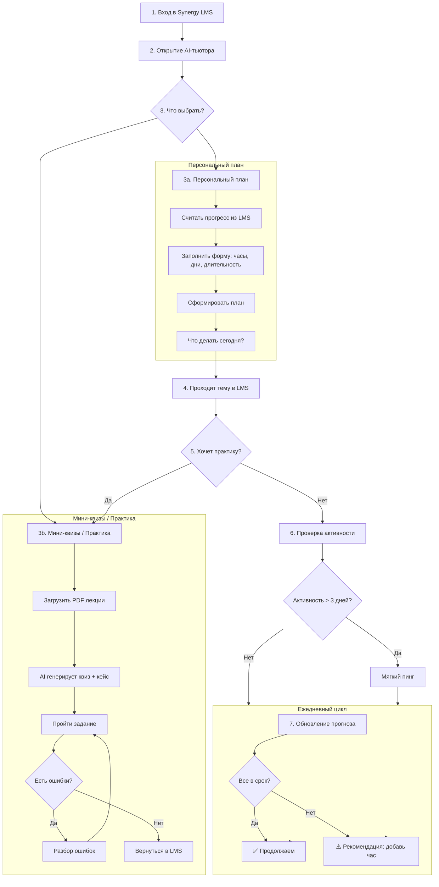

# Synergy LMS — User Flow (AI-тьютор)

*Ниже — визуальная схема основного сценария MVP*    

## 🔍 Подробное описание логики по шагам    
**Шаги 1–2: Инициализация**    
* Вход в LMS: студент аутентифицирован в Synergy.
* Запуск тьютора: нажатие на иконку расширения → popup с выбором функций.

**Шаг 3a: Персональный план**    

1. Система предлагает считать текущий прогресс (парсинг DOM: дисциплины, темы, статусы).
2. Студент заполняет форму:
   * Сколько часов в неделю может учиться?
   * Какие дни подходят?
   * Предпочитает короткие или длинные сессии?
3. Нажимает «Сформировать план» → backend генерирует:
   * долгосрочный план на семестр,
   * блок «Что делать сегодня».

**Шаг 3b: Мини-квизы и практика**

1. Студент загружает PDF-файл лекции (скачанный из LMS).
2. Расширение отправляет файл на backend.
3. Backend:
   * извлекает текст,
   * генерирует мини-квиз (3–5 вопросов) и практический кейс.
4. Студент проходит задание → при ошибках получает разбор без прямых ответов.
   
**Шаги 4–7: Учебный цикл и поддержка**    
* После прохождения темы в LMS студент может вернуться в тьютор за практикой.
* Система ежедневно пересчитывает прогноз.
* При неактивности >3 дней — мягкий пинг (без давления).

## ⚙️ Технические выводы для разработки    
* **Триггеры**:
  * Загрузка PDF → генерация квиза.
  * Заполнение формы → генерация плана.
  * Парсинг DOM → обновление прогресса.    
 * **Хранение состояния**:
    * `progress` (из LMS),
    * `weeklyAvailability`(из формы),
    * `lastActive`,
    * `plan`.    
 * **Интеграционные точки**:
    * `/plan/generate` - с параметрами формы.
    * `/quiz/generate-from-pdf` - multipart upload.
      
  
  
