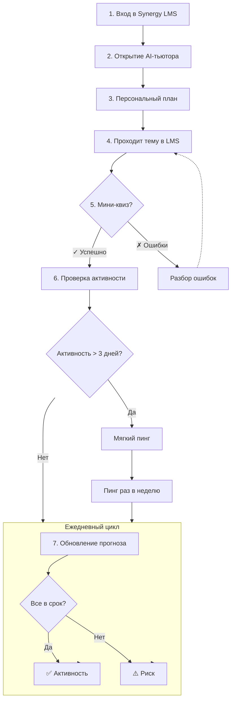

# Synergy LMS — User Flow (AI-тьютор)

Ниже — визуальная схема основного сценария.

---

## 🔍 Подробное описание логики по шагам  

**Шаги 1-3: Инициализация**  
1. Вход в LMS: Пользователь аутентифицируется в системе Synergy LMS.  
2. Запуск тьютора: Пользователь активирует расширение "AI-тьютор" через интерфейс браузера.  
3. Формирование плана: Система запрашивает параметры обучения и генерирует два ключевых артефакта:  
    * План на семестр (долгосрочный roadmap).
    * Что делать сегодня (таск на текущую сессию). Это отправная точка для ежедневного цикла.

**Шаги 4-5: Учебный цикл (ядро)**  
4. Работа с контентом: Пользователь изучает материалы и выполняет задания выбранной темы в интерфейсе самой LMS. Наша система только отслеживает статус  
5. Проверка знаний (Мини-квиз):  
* Система инициирует короткий тест из 3-5 вопросов по пройденной теме.
* Ветвление по результату:
    * ✅ Успешно → Поток переходит к мониторингу активности (Шаг 6).
    * ✗ Есть ошибки → Пользователю показывается разбор ошибок (без прямых подсказок), после чего поток возвращается (пунктирная стрелка) к шагу 4 для повторного прохождения темы.  

**Шаги 6-7: Мониторинг и поддержка мотивации**  
6. **Проверка активности (раз в 3 дня)**: Фоновая задача проверяет, были ли у пользователя учебные действия за последние 72 часа.  
7. **Ежедневный прогноз и уведомления (Цикл H)**:  
* Обновление прогноза: Ежедневно система пересчитывает, успевает ли пользователь по плану.
* Ветвление прогноза:
    * `Все в срок` → Статус фиксируется в прогнозе, цикл продолжается.
    * `Риск не успеть` → Пользователь получает рекомендацию **"добавь 1 час в выходные"**.
    * Эскалация уведомлений при неактивности:
        * Если активность отсутствует **> 3 дней**, отправляется **мягкий пинг** ("Ты не забыл про дисциплину?").
        * Если неактивность продолжается, система переходит в режим **пинга раз в неделю**.

## ⚙️ Технические выводы для разработки  
1. **Триггеры событий:**  
    * Расширение браузера должно отслеживать событие завершения темы в DOM LMS (шаг 4 → 5).  
    * Необходим фоновый скрипт или серверная задача для периодических проверок (шаги 6-7).  
2. **Хранение состояния:**  
    * Требуется хранить `статус темы`, `результаты квизов`, `дату последней активности` и `текущий прогноз`.  
3. **Цикличность процессов:**  
* Диаграмма содержит **два цикла**:
    * Малый (4 → 5 → 4) для отработки ошибок.  
    * Глобальный (через блок H) для ежедневной поддержки пользователя.  
4. Интеграционные точки (API/выход за рамки диаграммы):  
    * Для шагов 2-3 нужен доступ к API учебного плана.  
    * Для шага 5 необходим генератор вопросов и движок разбора ошибок.  
    * Для шагов 6-7 нужен сервис отправки уведомлений (email/push) и планировщик (cron).

---
